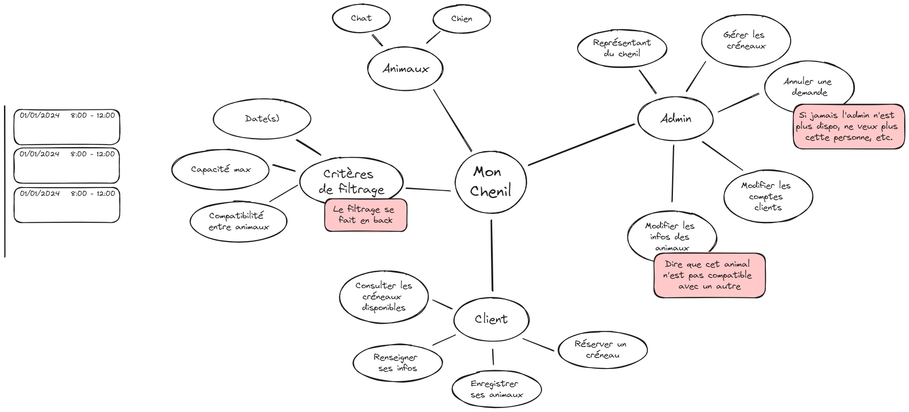

# Mon Chenil
Application de gestion d'un chenil

# Notes sur la Gestion des Créneaux et Tests pour l'Application

## Gestion des Créneaux

### Contexte Métier
- Les créneaux doivent pouvoir se chevaucher. L'utilisateur indique une durée souhaitée pour déposer son chien, avec une condition de **X chiens max** par créneau.
- Le système doit permettre de :
  - Sélectionner une **date de début** pour déposer le chien (toutes les 15 minutes).
  - Indiquer une **durée souhaitée** (s'appuyer sur Google Maps pour l'implémentation).
  - Choisir une **date de récupération** du chien.

### Liste d'Attente
- **Samy : NON** à la liste d'attente.
- Possibilité de confirmation par appel API avec un mock.

### Gestion des Incompatibilités
- Points à revoir et compléter.

## Tests du Front-End

### Écran Admin
- Vérifier l'affichage des créneaux.
- Tester les actions :
  - Suppression d'un créneau : vérifier que le créneau est bien supprimé de la liste affichée.
  - Ajout de créneau : vérifier l'ajout correct et suppression de la div correspondante.
- Valider les requêtes et les réponses des actions.

### Formulaire de Saisie des Animaux
- S'assurer que la requête est bien envoyée avec les bons paramètres.
- Tester les messages d'erreurs :
  - Vérifier l'affichage correct des erreurs.
  - Vérifier les couleurs, propriétés et que les messages ne sont pas cachés (`hidden`).

### Tests End-to-End
- Minimum un test end-to-end simulant un navigateur (même en headless).
- Utiliser **Playwright** pour générer du code facilement.

## Repository et Architecture

### Repository Générique
- Pas recommandé : se limite au CRUD sans validation métier.

### Projet CSPROJ
- Un seul projet CSPROJ n'est pas idéal pour une architecture testable.
- Éviter les noms de projet comme "service" qui sont des code smells.
- Proposer une architecture hexagonale pour une meilleure séparation des responsabilités :
  - Un projet pour récupérer les données web et répondre.
  - Un autre pour les domaines métier.

### Ressources
- [L'Architecture Hexagonale par la pratique](https://youtu.be/-dXN8wkN0yk) - Devoxx FR.

## Classes et Méthodes

### Méthodes et Objets
- `ArePetsCompatible` devrait être dans la classe `Pet`, pas dans `TimeSlotService`. Utiliser une approche orientée objet plutôt que procédurale.
- `ClientsCanSelectPetsForBooking` ne doit pas contenir de logique liée aux types `PetType.Cat` ou `PetType.Dog`.

### Refactorisation
- Refactoriser les `fakeRepository` / `petRepository` pour éviter les duplications.

### Classe Pet
- Remplacer la classe `Pet` d'Entity Framework par une vraie classe métier.
- Ou créer une deuxième classe `Pet` spécifique au métier.

## Tests des Contrôleurs
- Tester les contrôleurs, potentiellement avec des tests end-to-end.
- Tester les routes protégées :
  - Vérifier qu'un utilisateur connecté ne peut pas effectuer certaines actions.
  - S'assurer dans la couche domaine que l'utilisateur a les droits nécessaires.

## Conclusion
Ces notes détaillent les points clés pour la gestion des créneaux, les tests du front-end, l'architecture, et les bonnes pratiques de développement et de test pour garantir un code robuste et maintenable.

## Brainstorming

